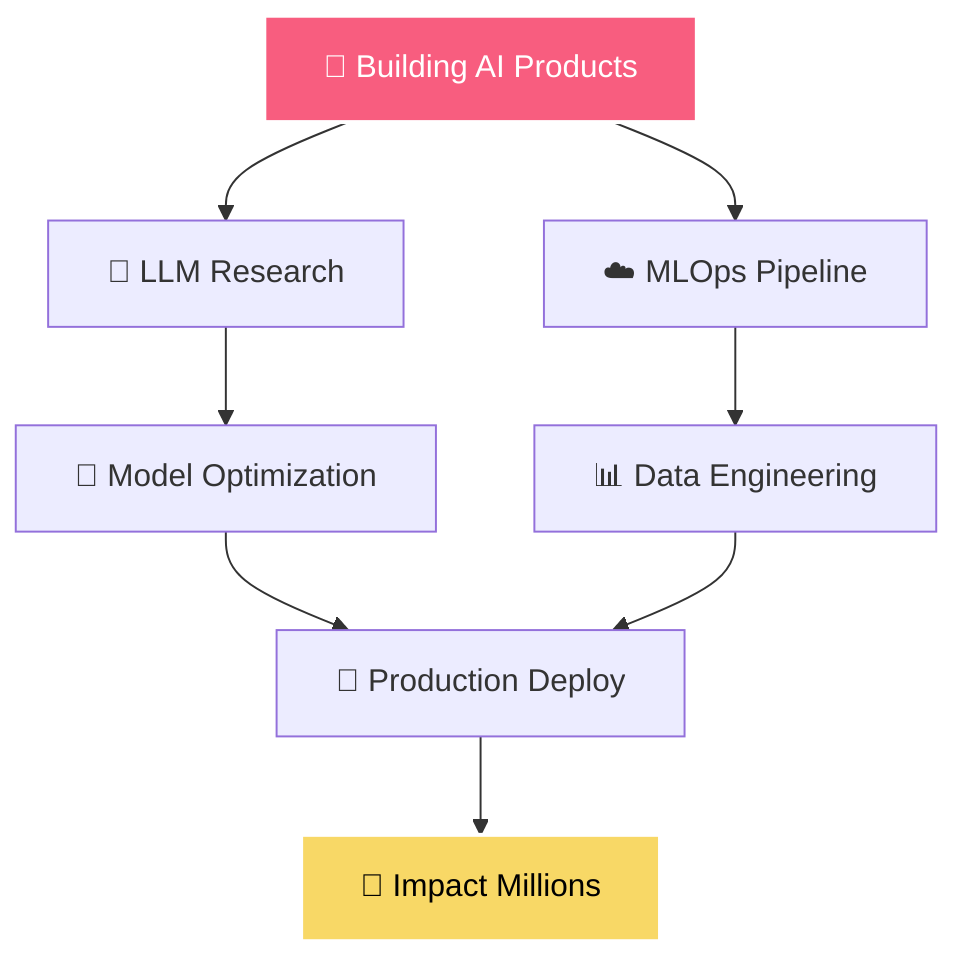

<div align="center">
  
</div>

<div align="center">
  
</div>

<p align="center">
  
</p>

<p align="center">
  
</p>

<div align="center">
  
  [](https://yourportfolio.com)
  [](https://www.linkedin.com/in/aditya-deshmukh-2587ab1ba)
  [](mailto:your.email@gmail.com)
  [](#)
  
</div>

<div align="center">
  
</div>

## ***About Me***

<picture></picture>

<br>

```yaml
name: Aditya Deshmukh
located_in: Bengaluru, India
current_job: Data Scientist & AI Engineer
education: ["Computer Science", "Data Science"]
status: Student

fields_of_interests:
  - "Artificial Intelligence"
  - "Machine Learning Operations"
  - "Full Stack Development"
  - "Data Engineering"
  - "Robotics"
  
technical_background:
  - "AI/ML Model Development"
  - "MLOps & Production Deployment"
  - "Web Application Development"
  - "Data Pipeline Architecture"
  - "Automation & Scripting"

currently_learning: ["LLMs", "MLOps", "Data Science"]
2025_goals: ["Contribute to Open Source", "Build AI Products", "Tech Leadership"]
hobbies: ["Problem Solving", "Technology", "Innovation"]
```

<br>

## ***Tech Arsenal*** 

<div align="center">

###  **AI & Machine Learning**


[](https://python.org)
[](https://tensorflow.org)
[](https://pytorch.org)
[](https://scikit-learn.org)
[](https://pandas.pydata.org)
[](https://numpy.org)
[](https://scipy.org)


### 🌐 **Web Development**


[](https://developer.mozilla.org/en-US/docs/Web/HTML)
[](https://developer.mozilla.org/en-US/docs/Web/CSS)
[](https://javascript.com)
[](https://reactjs.org)
[](https://nodejs.org)
[](https://fastapi.tiangolo.com)
[](https://tailwindcss.com)

### 💾 **Databases**


[](https://postgresql.org)
[](https://mysql.com)
[](https://firebase.google.com/)


</div>


##  ***GitHub Statistics*** 

<div align="center">
<table>
<tr>
<td width="50%">


</td>
<td width="50%">


</td>
</tr>
</table>
</div>

<div align="center">

</div>

##  ***Development Breakdown***

<!--START_SECTION:waka-->
```text
💻  I Spent My Time On

Python       █████████████████▓░░░   68.2%
Analytu=ics  ████████▓░░░░░░░░░░░░   15.4%
SQL          ██████▓░░░░░░░░░░░░░░   10.1%
Javascript   ████▓░░░░░░░░░░░░░░░░    4.8%
YAML         ██▓░░░░░░░░░░░░░░░░░░    1.5%

Editors:

VS Code      ████████████████▓░░░░░   70%
Jupyter      █████████▓░░░░░░░░░░░░   30%

```


<!--END_SECTION:waka-->

<p align="center">
  
</p>

##  ***GitHub Trophies***

<div align="center">
  
</div>

## 🐍 ***Contribution Eater***

<picture>
  <source media="(prefers-color-scheme: dark)" srcset="https://raw.githubusercontent.com/Adi-Deshmukh/Adi-Deshmukh/output/pacman-contribution-graph-dark.svg">
  <source media="(prefers-color-scheme: light)" srcset="https://raw.githubusercontent.com/Adi-Deshmukh/Adi-Deshmukh/output/pacman-contribution-graph.svg">
  
</picture>

###


##  Featured Projects

<div align="center">
<table>
<tr>
<td width="50%">
  
**[Netflix_BC](https://github.com/Adi-Deshmukh/netflix_bc)**

 **Netflix_BC** • `Data Analysis`

Data Analytics of Netflix Dataset and getting insights

```
🔧 Key Features:
• Advanced data cleaning
• Exploratory Data Analysis (EDA)
• Visualizations of content by genre,
  country, rating, director, cast , time etc
•Insight extraction for business decision support

```


</td>
<td width="50%">

**[Data_Profiler](https://github.com/Adi-Deshmukh/data_profiler)**

📊 **Data Analytics Tool** • `Python Library`

Comprehensive data profiling and quality assessment toolkit

```
🔧 Key Features:
• Automated data quality checks
• Statistical analysis & insights
• Data visualization dashboards
• Missing value detection
• Export detailed HTML reports
```


</td>
</tr>
</table>

<p align="center">
  <a href="https://github.com/Adi-Deshmukh?tab=repositories">
    
  </a>
</p>

</div>

---

##  ***Current Mission***

<div align="center">



---


##  ***Profile Analytics***

<div align="center">
  
  
  
</div>


<div align="center">
  
</div>

<div align="center">
  <h2> "Code is Poetry, Data is Art and I Am the Artist "</h2>
  <p><i>Let's build the future together, one algorithm at a time! </i></p>
  
  
</div>
